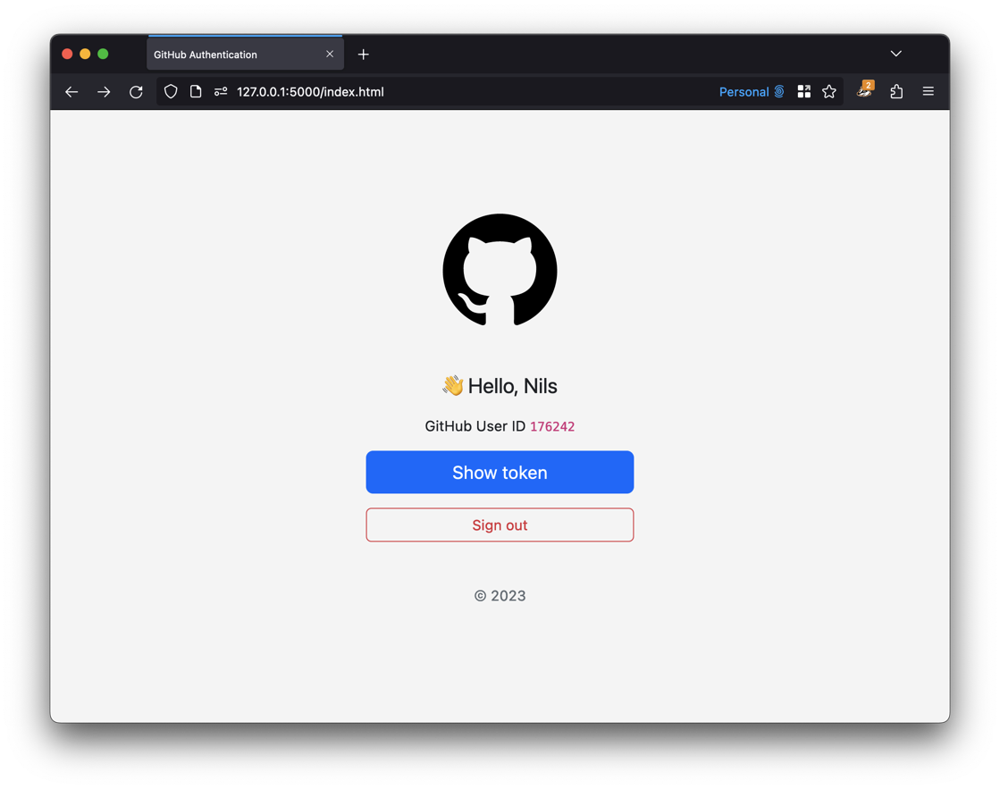
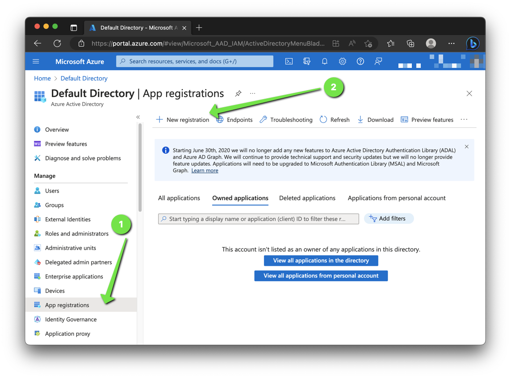
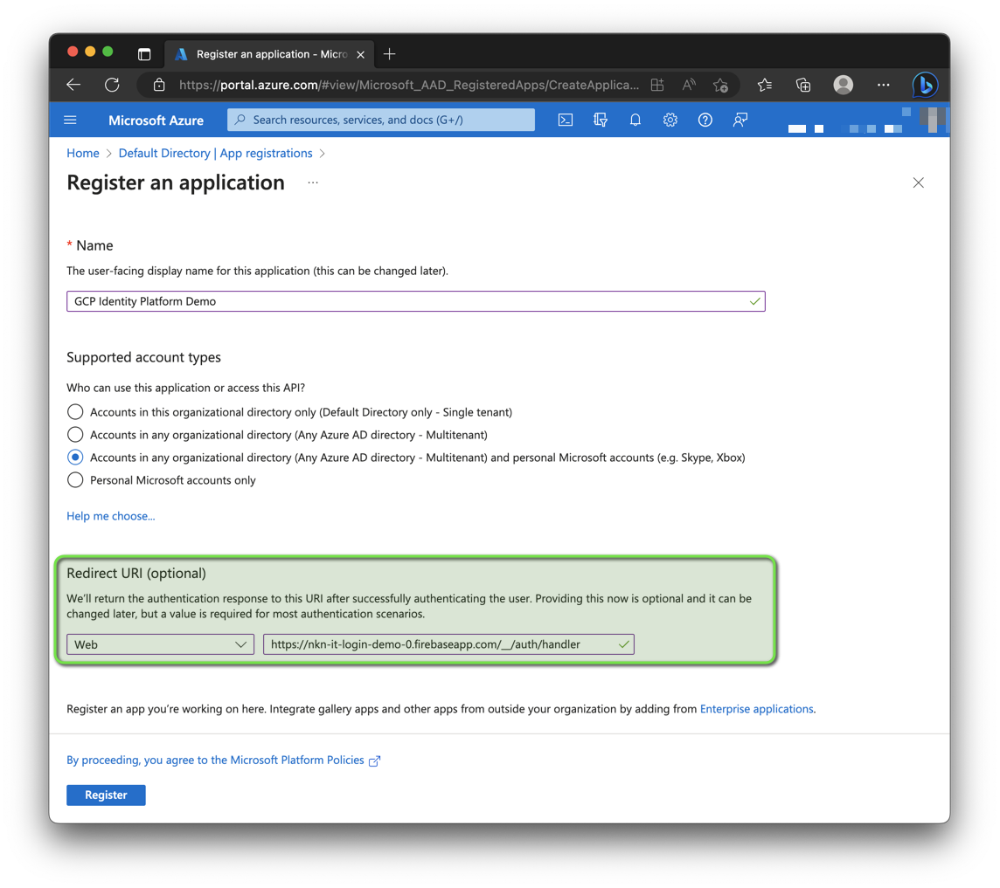
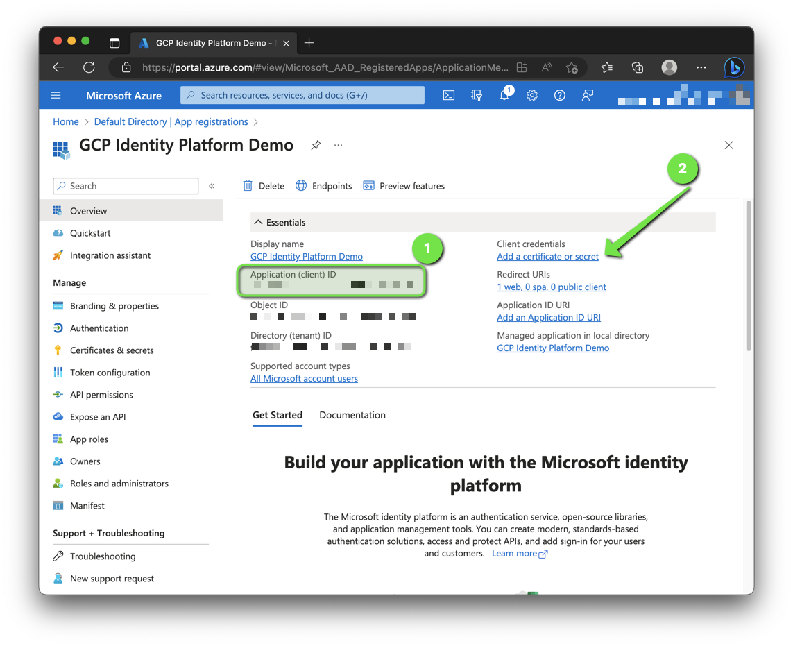
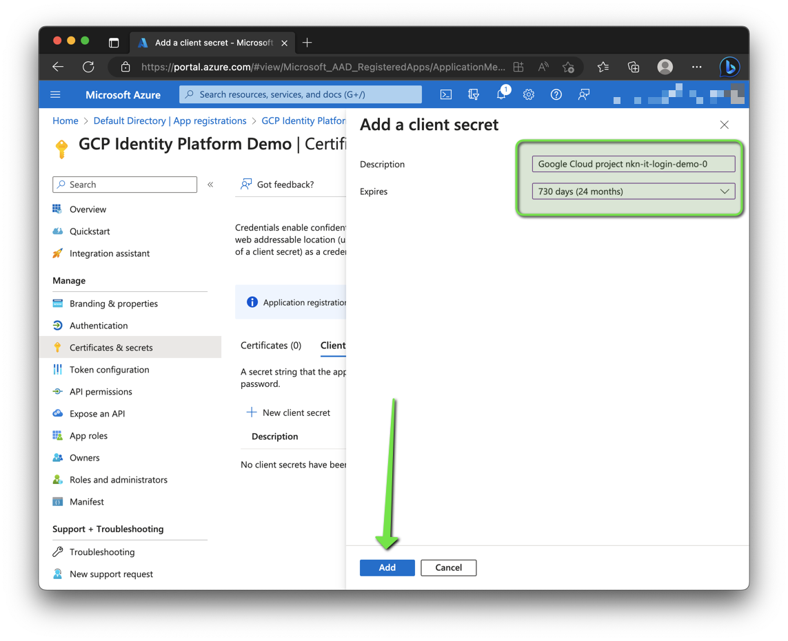
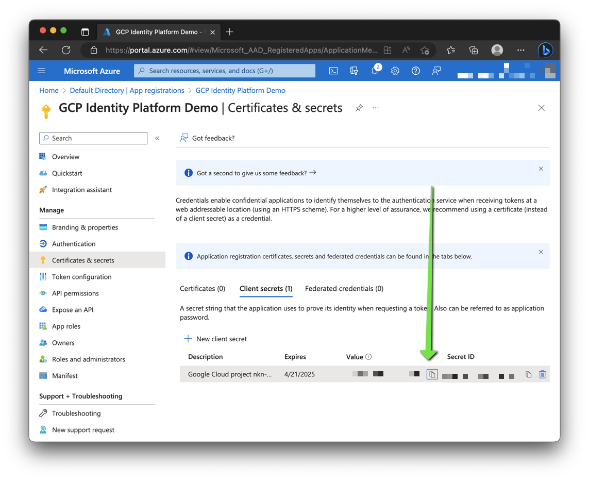
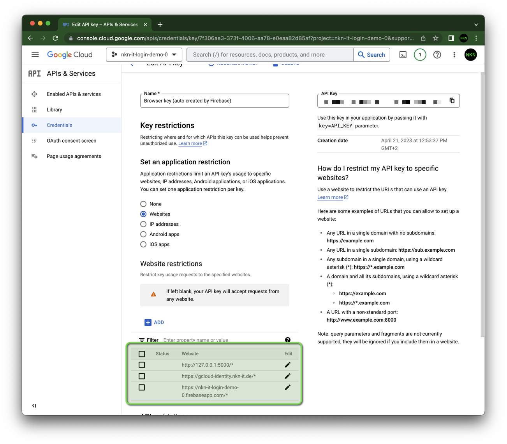

# Google Cloud Identity Platform

In this repo you find examples and a step-by-step documentation how to configure [Google Cloud Identity Platform](https://cloud.google.com/identity-platform).

I explain here how you can develop a webapp and implement login with GitHub via Google Cloud Identity Platform.

## Demo

**👉 [gcloud-identity.nkn-it.de](https://gcloud-identity.nkn-it.de/)**

## :octocat: Signing in users with GitHub

To configure GitHub as an identity provider:

1. Go to the Identity Platform ([Tools -> Identity Platform](https://console.cloud.google.com/customer-identity?project=_)) page in the Google Cloud console.
1. Enable Identity Platform.
  
1. Click Add A Provider.
  
1. Configure sign-in method.
  
    1. Select **GitHub** from the list
    1. Register your app's domains (in my example the GitHub Page `gcloud-identity.nkn-it.de`) by clicking "Add Domain" under Authorized Domains. For development purposes, `localhost` is already enabled by default.
    I added additional the local IP `127.0.0.1`.
    1. Copy callback URL for the GitHub app configuration.
    1. Client ID and Client Secret are currently not known.
    Continue with the setup of the GitHub app to get the values.
1. Navigate to your GitHub account or organizations settings.
   In the left sidebar, click "Developer settings".
   Click then "GitHub Apps".
  
1. Click "New GitHub App".
    
1. Under "GitHub App name", enter a name for your app.
  You should choose a clear and short name. Your app's name (converted to lowercase, spaces replaced by `-`) will be shown in the user interface when your app takes an action.
1. Under "Homepage URL", type the full URL to your app's website.
   If you don’t have a dedicated URL you can use the URL of the organization or user that owns the app.
1. Under "Callback URL", enter the full URL you copied during the Google Cloud identity provider configuration.
    
1. Under "Permissions" you do not have to select anything. We only want to enable login.
1. Disable the receive of webhook events, deselect "Active".
   Under "Where can this GitHub App be installed?", select "Only on this account" account.
    
1. Click "Create GitHub App".
1. Generate a new client secret
    
1. Copy Client ID and Client Secret for the Google Cloud identity provider configuration.
    
1. Continue the configuration of the Google Cloud identity provider.
    
    1. Paste Client ID from GitHub app.
    1. Paste Client Secret from GitHub app.
    1. Click "Setup Details".
1. Copy the `apiKey` and `authDomain` for your webapp (JavaScript).
   I use [`config.js`](./page/config.js).
    
1. Save the GitHub provider.
1. Done 🎉

You can now start integrating the GitHub provider into your webapp. I have prepared an example with comments:

* [Website (`github.html`)](./page/github.html)
* [JavaScript (`github.js`)](./page/github.js)

## 🪟 Signing in users with Microsoft

I don't describe the configuration in as much detail as I do with [GitHub](#octocat-signing-in-users-with-github).
The configuration is similar.

The most important steps are...

### Register an application

1. Sign in to the [Azure portal](https://portal.azure.com/).
1. Search for and select Azure Active Directory.
1. Under Manage, select App registrations -> New registration.
  
1. Enter a display Name and as redirect URI your Firebase URL.
  
1. Select Register to complete the initial app registration.
1. When registration finishes, the Azure portal displays the app registration's Overview pane. You see the Application (client) ID.
  
    1. Copy the application (client) ID.
    1. Add a new client secret.
1. Create a new client secret.
  
1. Enter a description and choose an expiration date.
  
1. Copy the value of the application (client) secret.
  

### Create Microsoft provider

1. Go to the Identity Platform page in the Google Cloud console and create a new provider (Microsoft). Paste App ID and App Secret.
  

## 🔑 Signing in users with Google

I don't describe the configuration in as much detail as I do with [GitHub](#octocat-signing-in-users-with-github).
The configuration is similar.

The most important steps are...

### Configure your OAuth Consent Screen

1. Open the OAuth consent screen ([Management -> APIs & Services -> OAuth consent screen](https://console.cloud.google.com/apis/credentials/consent?project=_)) page in the Google Cloud console and create a new screen. 
  
1. On the "OAuth consent screen" page, fill out the form and click the "Save" button.
  

### Get your Google API client ID

1. Open the Credentials page in the Google Cloud console.
  Use the existing web client ID or create a new one.
  
1. Copy the Client ID and Client secret.
  

### Create Google provider

1. Go to the Identity Platform page in the Google Cloud console and create a new provider (Google). Paste Client ID and Client Secret.
  

## 🔐 Security

The Google API key (`apiKey`) is publicly accessible (i.e. in [`config.js`](./page/config.js))!

According to the [Firebase documentation](https://firebase.google.com/docs/projects/api-keys#general-info), this is not a problem and not a security issue.
To implement some extra precautions and not to see the warning you can limit the auto-created keys by Firebase.

1. You can view and manage all your project's API keys in the <a href="https://console.cloud.google.com/projectselector2/apis/credentials?project=_">APIs & Services -> Credentials</a> panel in the Google Cloud Console.
1. Select "Browser key (auto created by Firebase)".
1. Restrict key usage to specified websites.
   Add your Firebase website and all other websites.
    

You can also implement other restrictions, like reducing the `identitytoolkit.googleapis.com` [API quota](https://console.cloud.google.com/apis/api/identitytoolkit.googleapis.com/quotas?project=_) of the project.

## 📚 More to read

* GitHub
  * [Creating a GitHub App](https://docs.github.com/en/apps/creating-github-apps/creating-github-apps/creating-a-github-app) (GitHub Docs)
  * [Signing in users with GitHub](https://cloud.google.com/identity-platform/docs/web/github) (Google Docs)
* Microsoft
  * [Register an Azure AD application](https://learn.microsoft.com/en-us/azure/active-directory/develop/quickstart-register-app#register-an-application) (Microsoft Docs)
  * [Signing in users with Microsoft](https://cloud.google.com/identity-platform/docs/web/microsoft) (Google Docs)
* Google
  * [Signing in users with Google](https://cloud.google.com/identity-platform/docs/web/google) (Google Docs)
* [Alternative ways to add Firebase to your JavaScript project](https://firebase.google.com/docs/web/alt-setup#from-the-cdn) (Firebase Docs)
* [FirebaseUI for Web](https://github.com/firebase/firebaseui-web#readme) (GitHub repo)
* [Verify ID tokens using a third-party JWT library](https://firebase.google.com/docs/auth/admin/verify-id-tokens#verify_id_tokens_using_a_third-party_jwt_library) (Firebase Docs)
* [Learn about using and managing API keys for Firebase](https://firebase.google.com/docs/projects/api-keys) (Firebase Docs)

## ❤️ Contributing

Have a patch that will benefit this project?
Awesome! Follow these steps to have it accepted.

1. Please read [how to contribute](CONTRIBUTING.md).
1. Fork this Git repository and make your changes.
1. Create a Pull Request.
1. Incorporate review feedback to your changes.
1. Accepted!

## 📜 License

All files in this repository are under the [Apache License, Version 2.0](LICENSE) unless noted otherwise.

Portions of this webapp are modifications based on work created and shared by [Google](https://developers.google.com/readme/policies)
and used according to terms described in the [Creative Commons 4.0 Attribution License](https://creativecommons.org/licenses/by/4.0/).
