# :octocat: Signing in users with GitHub

To configure GitHub as an identity provider:

1. Go to the Identity Platform ([Tools -> Identity Platform](https://console.cloud.google.com/customer-identity?project=_)) page in the Google Cloud console.
1. Enable Identity Platform.
  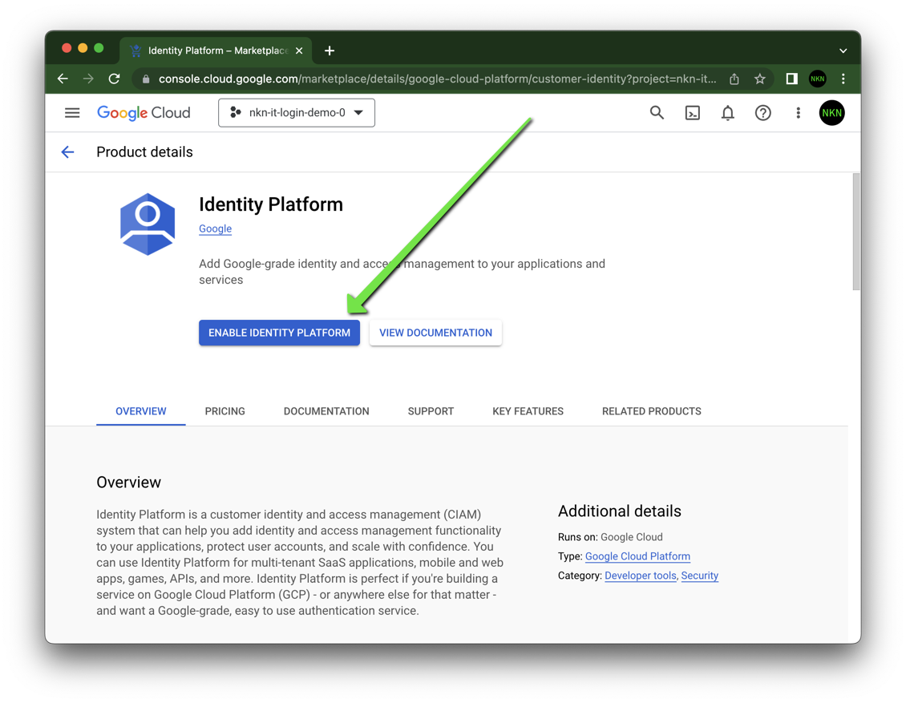
1. Click Add A Provider.
  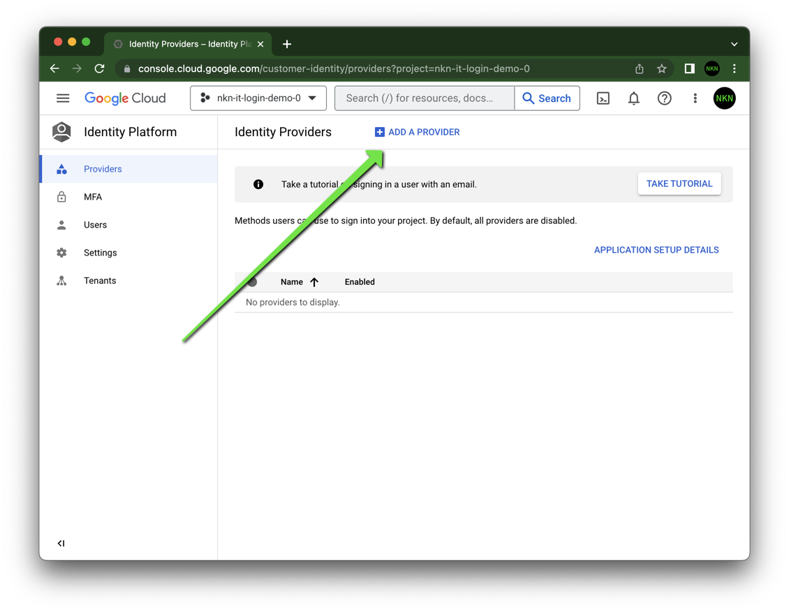
1. Configure sign-in method.
  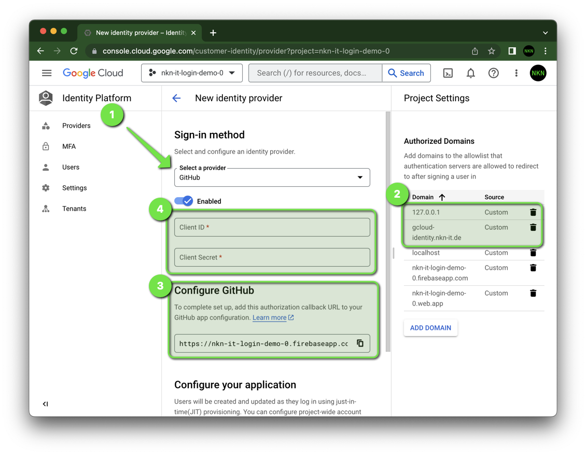
    1. Select **GitHub** from the list
    1. Register your app's domains (in my example the GitHub Page `gcloud-identity.nkn-it.de`) by clicking "Add Domain" under Authorized Domains. For development purposes, `localhost` is already enabled by default.
    I added additional the local IP `127.0.0.1`.
    1. Copy callback URL for the GitHub app configuration.
    1. Client ID and Client Secret are currently not known.
    Continue with the setup of the GitHub app to get the values.
1. Navigate to your GitHub account or organizations settings.
   In the left sidebar, click "Developer settings".
   Click then "GitHub Apps".
  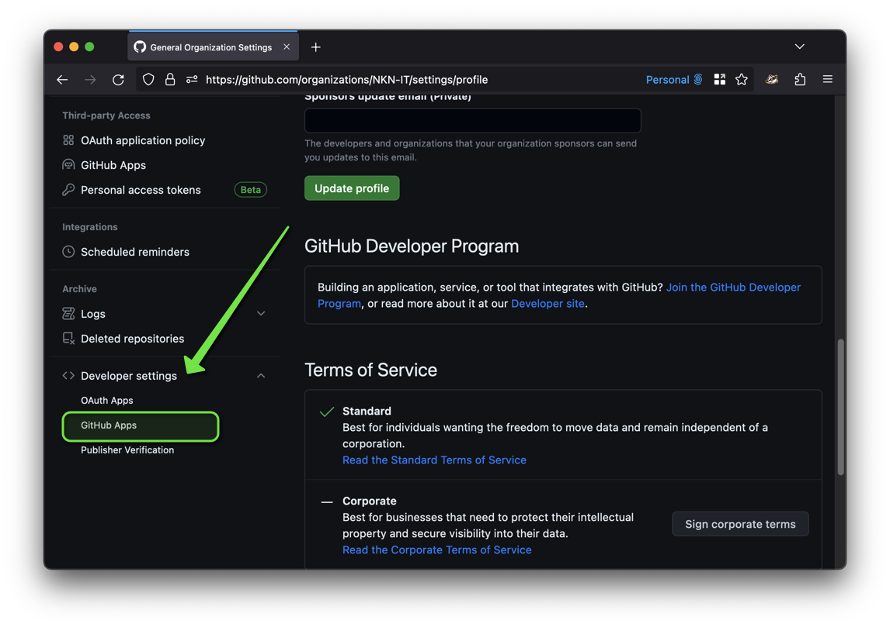
1. Click "New GitHub App".
    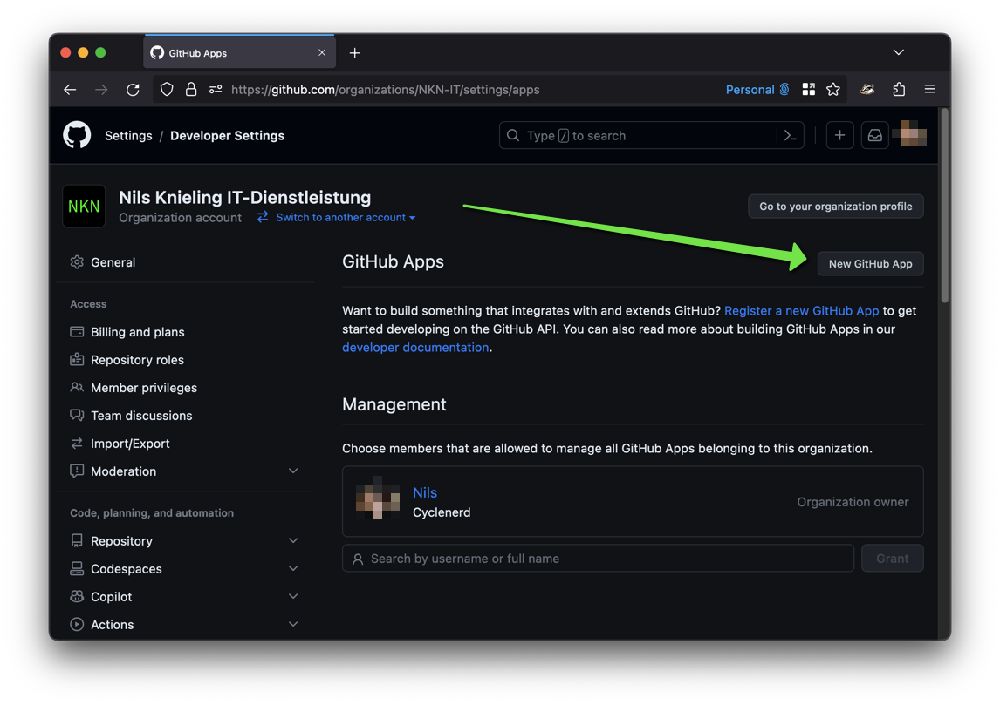
1. Under "GitHub App name", enter a name for your app.
  You should choose a clear and short name. Your app's name (converted to lowercase, spaces replaced by `-`) will be shown in the user interface when your app takes an action.
1. Under "Homepage URL", type the full URL to your app's website.
   If you don’t have a dedicated URL you can use the URL of the organization or user that owns the app.
1. Under "Callback URL", enter the full URL you copied during the Google Cloud identity provider configuration.
    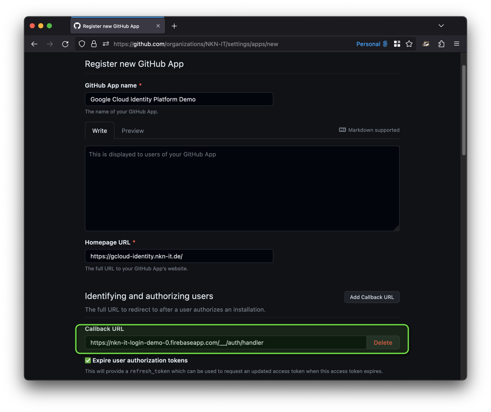
1. Under "Permissions" you do not have to select anything. We only want to enable login.
1. Disable the receive of webhook events, deselect "Active".
   Under "Where can this GitHub App be installed?", select "Only on this account" account.
    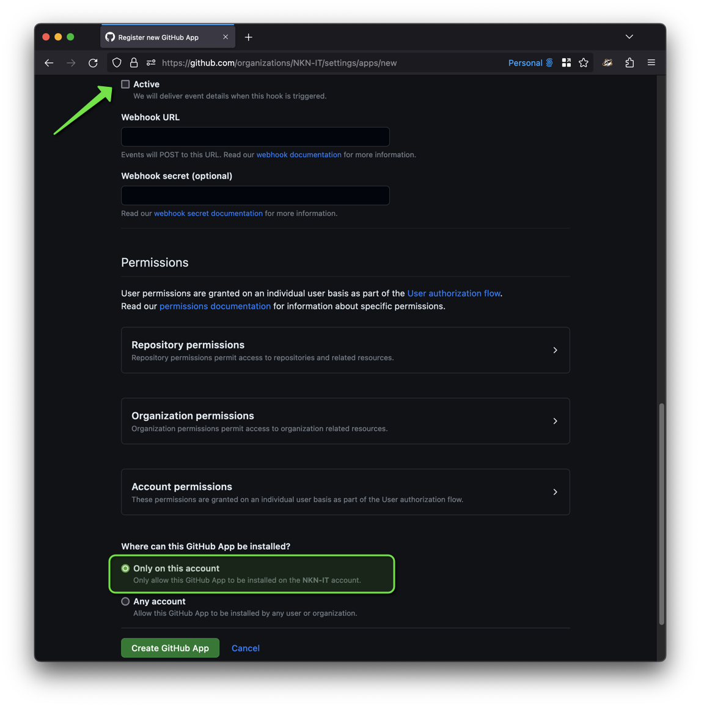
1. Click "Create GitHub App".
1. Generate a new client secret
    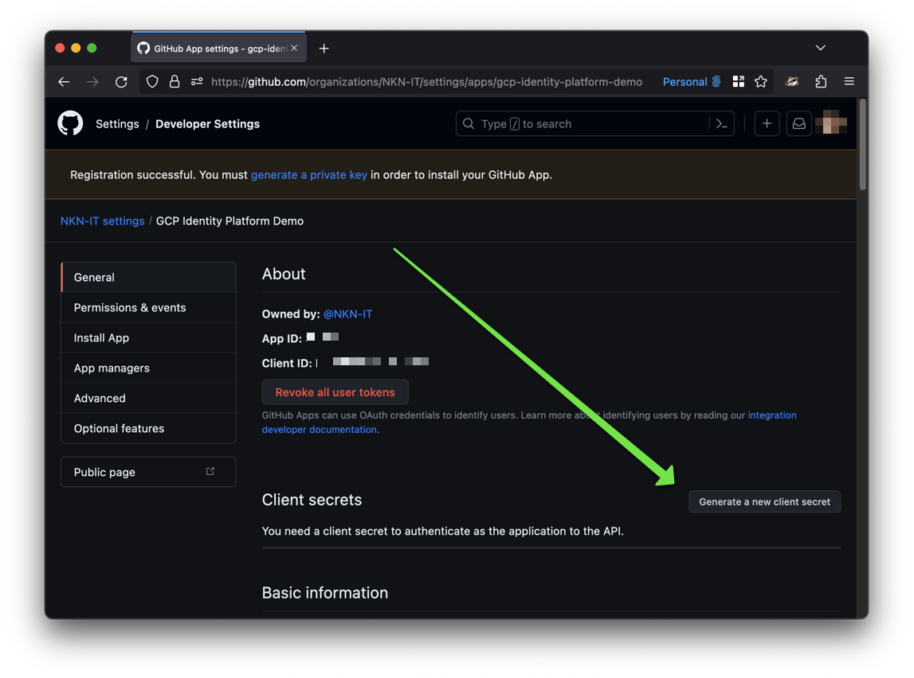
1. Copy Client ID and Client Secret for the Google Cloud identity provider configuration.
    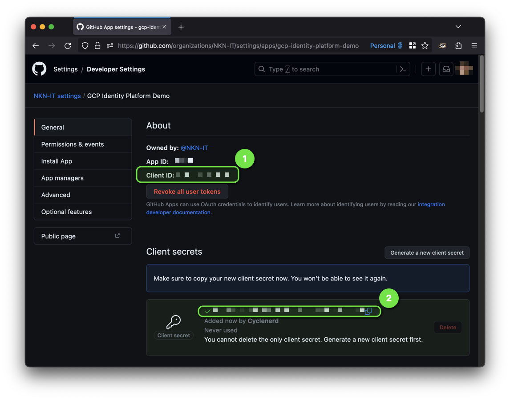
1. Continue the configuration of the Google Cloud identity provider.
    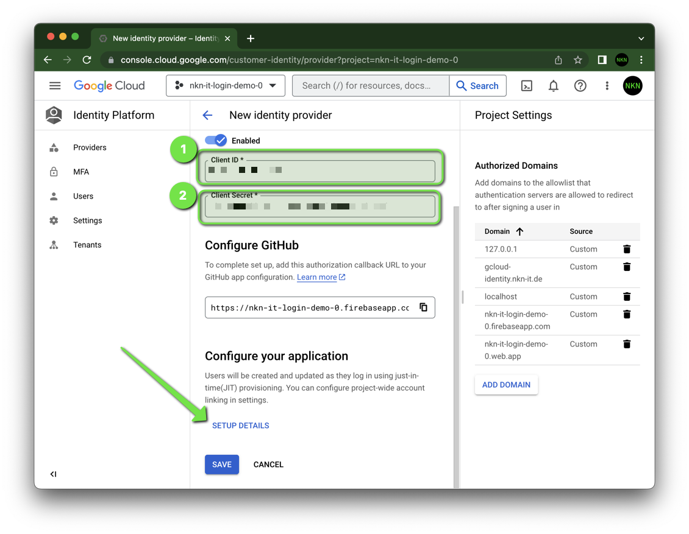
    1. Paste Client ID from GitHub app.
    1. Paste Client Secret from GitHub app.
    1. Click "Setup Details".
1. Copy the `apiKey` and `authDomain` for your webapp (JavaScript).
   I use [`config.js`](./page/config.js).
    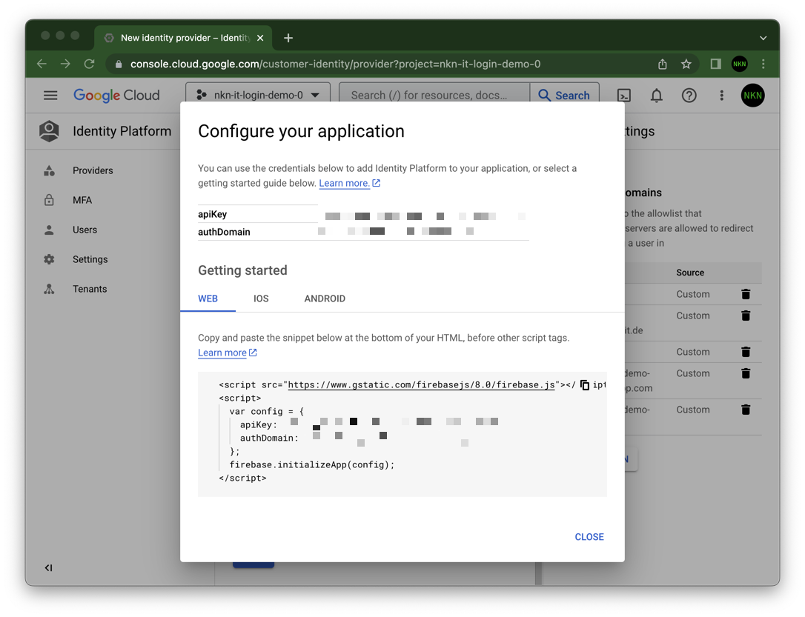
1. Save the GitHub provider.
1. Done 🎉

You can now start integrating the GitHub provider into your webapp. I have prepared an example with comments:

* [Website (`github.html`)](./page/github.html)
* [JavaScript (`github.js`)](./page/github.js)