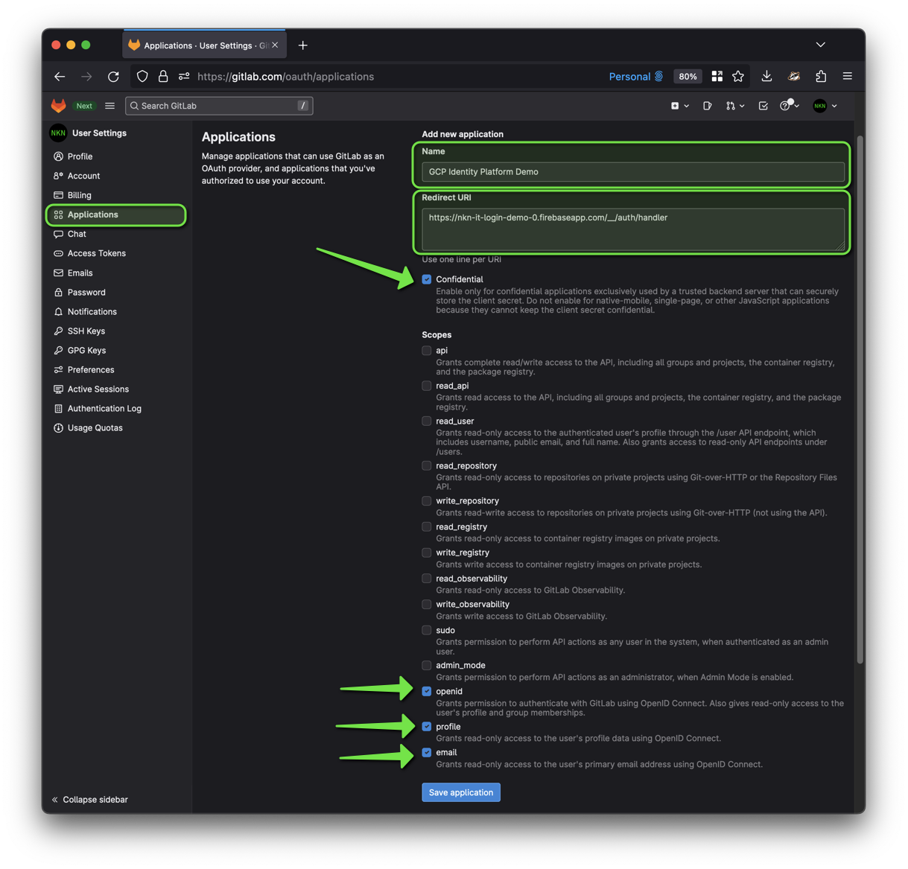
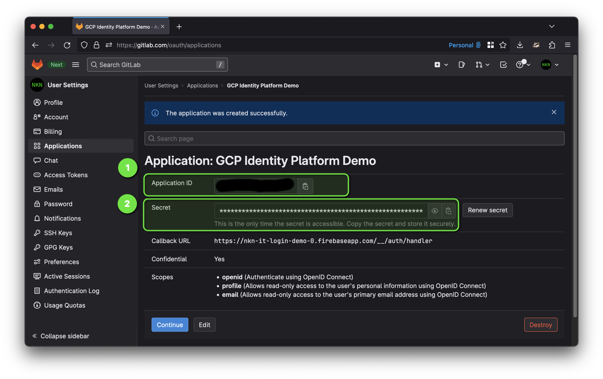
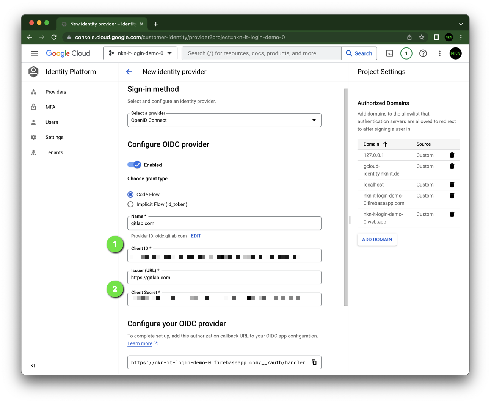

# 🦊 Signing in users with GitLab

This how-to assumes you've already enabled Identity Platform,
and have a basic knowledge.
Please see the [GitHub](./github.md) tutorial to learn how.

The most important steps are...

## Register an application

1. Sign in to [GitLab](https://gitlab.com/).
1. On the top bar, in the upper-right corner, select your avatar.
1. Select Edit profile.
1. On the left sidebar, select Applications.
1. Enter a Name and your Firebase URL as Redirect URI. Select OAuth 2 Scopes `openid`, `profile` and `email`.
  
1. Select Save application. GitLab provides:
  
    1. The Client ID in the Application ID field
    1. The Client Secret

## Create OpenID Connect provider

1. Go to the Identity Platform page in the Google Cloud console and create a new provider (OpenID Connect). Paste Client ID and Client Secret.
  

## JavaScript

Create an `OAuthProvider` instance with the provider ID you configured in the previous section.
The provider ID must start with `oidc.`:

```javascript
const provider = new firebase.auth.OAuthProvider('oidc.gitlab.com');
```

I have prepared an example with comments:

* [Website (`gitlab.html`)](./page/gitlab.html)
* [JavaScript (`gitlab.js`)](./page/gitlab.js)