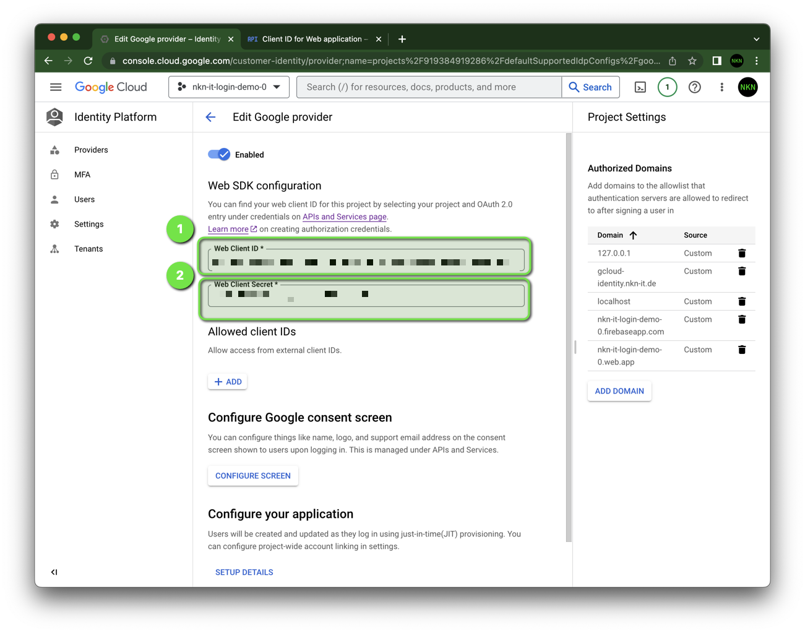

# 🔑 Signing in users with Google

This how-to assumes you've already enabled Identity Platform,
and have a basic knowledge.
Please see the [GitHub](./github.md) tutorial to learn how.

The most important steps are...

## Configure your OAuth Consent Screen

1. Open the OAuth consent screen ([Management -> APIs & Services -> OAuth consent screen](https://console.cloud.google.com/apis/credentials/consent?project=_)) page in the Google Cloud console and create a new screen. 
  
1. On the "OAuth consent screen" page, fill out the form and click the "Save" button.
  

## Get your Google API client ID

1. Open the Credentials page in the Google Cloud console.
  Use the existing web client ID or create a new one.
  
1. Copy the Client ID and Client secret.
  

## Create Google provider

1. Go to the Identity Platform page in the Google Cloud console and create a new provider (Google). Paste Client ID and Client Secret.
  
