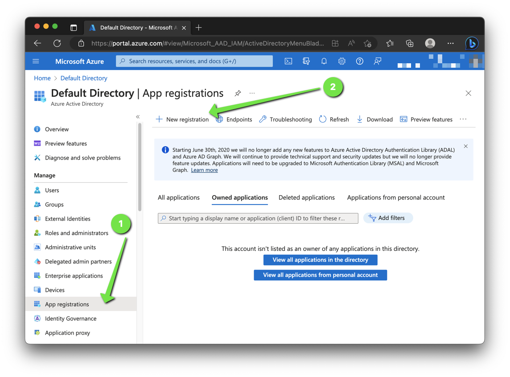
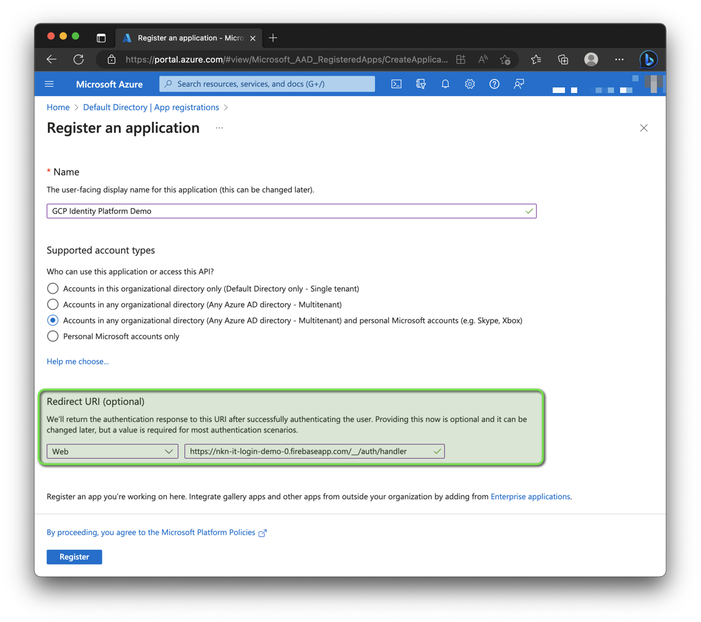
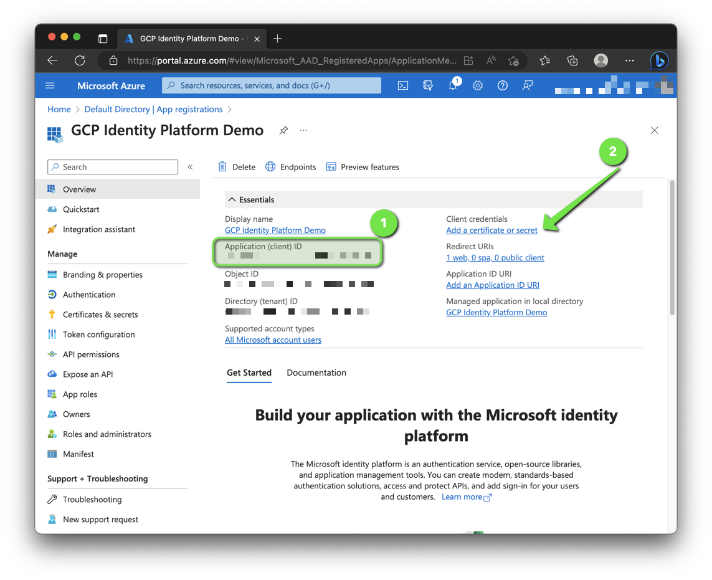
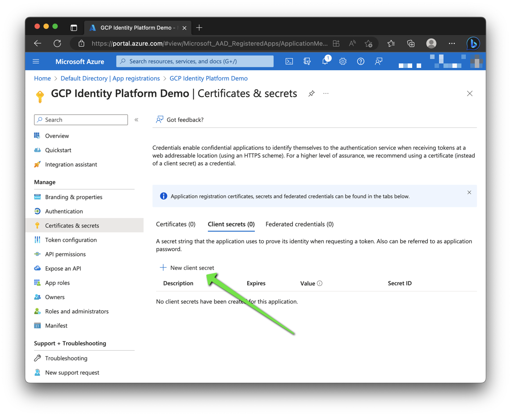
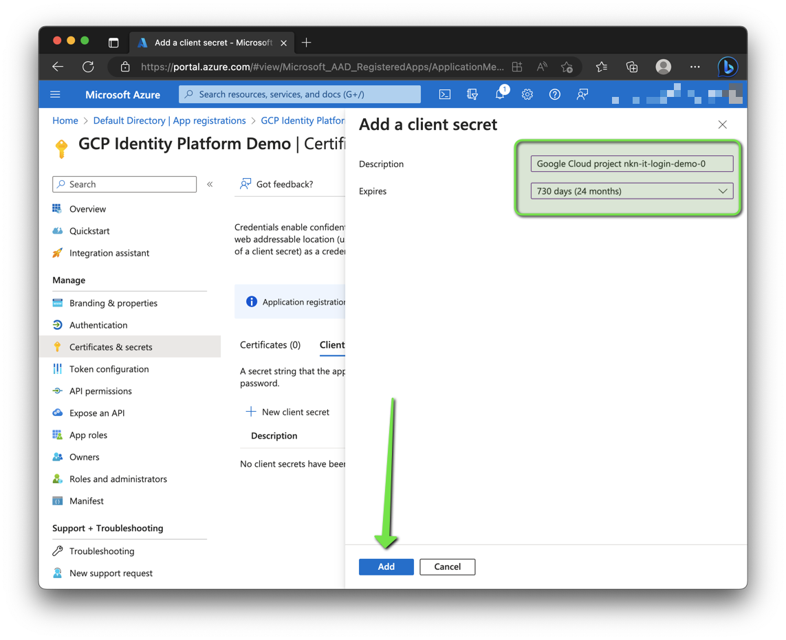
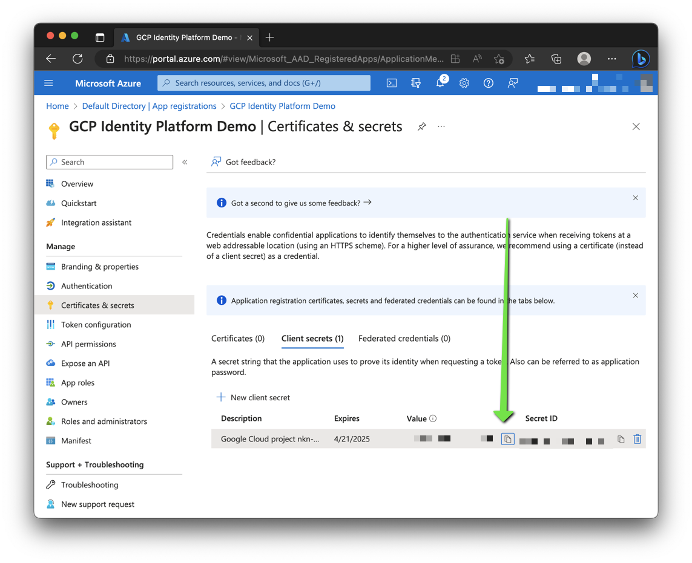
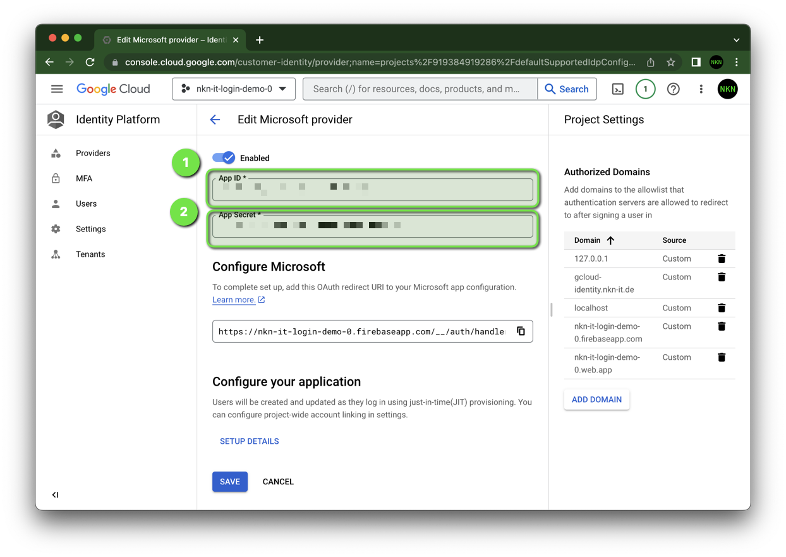

# 🪟 Signing in users with Microsoft

This how-to assumes you've already enabled Identity Platform,
and have a basic knowledge.
Please see the [GitHub](./github) tutorial to learn how.

The most important steps are...

## Register an application

1. Sign in to the [Azure portal](https://portal.azure.com/).
1. Search for and select Azure Active Directory.
1. Under Manage, select App registrations -> New registration.
  
1. Enter a display Name and as redirect URI your Firebase URL.
  
1. Select Register to complete the initial app registration.
1. When registration finishes, the Azure portal displays the app registration's Overview pane. You see the Application (client) ID.
  
    1. Copy the application (client) ID.
    1. Add a new client secret.
1. Create a new client secret.
  
1. Enter a description and choose an expiration date.
  
1. Copy the value of the application (client) secret.
  

## Create Microsoft provider

1. Go to the Identity Platform page in the Google Cloud console and create a new provider (Microsoft). Paste App ID and App Secret.
  