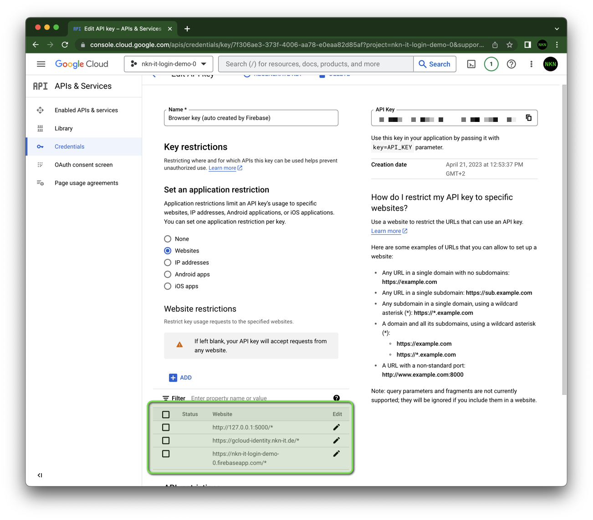

# 🔐 Security

The Google API key (`apiKey`) is publicly accessible (i.e. in [`config.js`](./page/config.js))!

According to the [Firebase documentation](https://firebase.google.com/docs/projects/api-keys#general-info), this is not a problem and not a security issue.
To implement some extra precautions and not to see the warning you can limit the auto-created keys by Firebase.

1. You can view and manage all your project's API keys in the <a href="https://console.cloud.google.com/projectselector2/apis/credentials?project=_">APIs & Services -> Credentials</a> panel in the Google Cloud Console.
1. Select "Browser key (auto created by Firebase)".
1. Restrict key usage to specified websites.
   Add your Firebase website and all other websites.
    

You can also implement other restrictions, like reducing the `identitytoolkit.googleapis.com` [API quota](https://console.cloud.google.com/apis/api/identitytoolkit.googleapis.com/quotas?project=_) of the project.